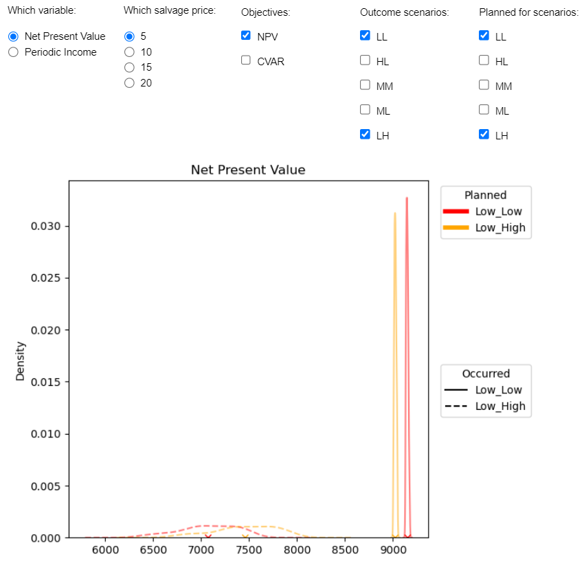

# WindRisk
This repository contains the code to run the stochastic programming models and code to generate figures to present the results. 

# Data processing and stochastic programming

## Overview

There are two python scripts used to create the scenarios used to represent the wind scenarios. The first python script "Create_Wind_Scenarios.py" creates wind scenarios to be used to assess the performance of the optimized solutions. This allows for a standardized examination of the results accross all optimizations irrespective of the frequency and intensity of the optimized solution. The second script "Stochastic_Programming_problem.py" conducts the optimization using selected parameters. 

## Requirements

To use this tool, ensure you have the following Python libraries installed:

- Matplotlib
- Pandas
- Numpy
- random
- os
- pyomo
- copy
- sqlite3
- pyutilib
- argparse

## How to Use

1. Ensure all the required libraries are installed.
2. Download the entire package to your desktop or virtual machine, additionally download either the databases of the simulations, or the aggregated data (either can be downloaded from....)
3. The python script to Create_Wind_Scenarios.py can be run, it will generate new files in the ./Data folder.
4. You can the run the script 'Stochastic_Programming_problem.py' based on the arguments fed to the script. An example script for used to generate results for the interactive ploting tool are included "SP_RUN_BATCH_CVaR.sh" and "SP_RUN_BATCH_NPV.sh".
5. Running the scripts will generate updated results to the results folder.
  
### Parameters in Create_Wind_Scenarios.py:

- `SCEN` (integer): The number of scenarios that will be used to represent the randomness of the wind risk.

### Parameters in Create_Wind_Scenarios.py:

- `V` (integer): The choice of wind frequency and intensity to be used, an integer where 0="Low_High",1="Mod_Mid",2="Mod_Low",3="High_Low",4="Low_Low"'.
- `P` (float): The salvage price used to value the timber extracted following wind damage.
- `OPT` (string): The choice of optimization objective, either focus on NPV  "NPV" or a focus on ensuring an even-flow to timber harvested.
- `INT` (float): The discount rate used in the analysis.
- `SCEN` (integer): The number of scenarios that will be used to represent the randomness of the wind risk.

## Example Usage

At the command line, in the base folder:

python python/Create_Wind_Scenarios.py --SCEN 100 #this will create new wind scenarios to evaluate the optimized solutions.

To run a large number of optimizations, a scripting tool, using a very large computer would be recommended. We used the CSC computer Puhti, using 2 cpu cores, with 64 Gb of memory to conduct the optimizations for each case. A total of 40 cases were explored. On average, running of a single instance took over 5 hours, with the majority of the time taken in constructing the stochastic programming model.

Example scripts based on a linux bash file can be found in the base ffolder "SP_RUN_BATCH_CVaR.sh" and "SP_RUN_BATCH_NPV.sh"

If adjustments to which scenarios are run, there my be a need to adjust the code for the interactive plotting tool. 

# Graphing: Interactive Plotting Tool

## Overview

This interactive plotting tool provides visualizations a selection of wind risk scenarios used in a draft manuscript exploring the potential of using stochastic programming for wind risk planning. We explore the trade-off between maximizing Net Present Value (NPV) and ensuring the even flow of periodic income. The tool leverages Matplotlib and Pandas libraries to create interactive graphs that allow users to explore and analyze various planning outcomes.

## Requirements

To use this plotting tool, ensure you have the following Python libraries installed:

- Matplotlib
- Pandas
- Numpy
- Scipy
- Jupyter Widgets (ipywidgets)

## How to Use

1. Ensure all the required libraries are installed.
2. Download the entire package to your desktop or virtual machine, including the folders holding the optimized results (the "results" folder), the python code containing the plotting functions, and the ipynb in the base folder.repository.
3. Import the functions into your Python script or Jupyter Notebook.
4. Use the functions to generate interactive plots for your data.

## Function Usage

### Function: `show_Period_plot_interactive`

This function generates a set of six interactive plots showing the Kernel Density Estimation (KDE) of Periodic Income scenarios. The plots allow you to visualize the distribution of income for different combinations of scenarios.

#### Parameters:

- `OCCUR` (list): A list of strings representing different scenarios for the occurance of wind intensity and frequency (e.g., "LL", "HL", "MM", "ML", "LH").
- `OBJECT` (list): A list representing which objective the user wishes to present.
- `PLANNED` (list): A list of strings representing different scenarios used in the optimization for wind intensity and frequency
- `SALVAGE` (string): A string representing the assumed salvage price used.

### Function: `show_NPV_plot_interactive`

This function generates an interactive plot showing the Kernel Density Estimation (KDE) of Net Present Value (NPV) scenarios. The plot allows you to visualize the distribution of NPV for different combinations of scenarios.

#### Parameters:

- `OCCUR` (list): A list of strings representing different scenarios for the occurance of wind intensity and frequency (e.g., "LL", "HL", "MM", "ML", "LH").
- `OBJECT` (list): A list representing which objective the user wishes to present.
- `PLANNED` (list): A list of strings representing different scenarios used in the optimization for wind intensity and frequency
- `SALVAGE` (string): A string representing the assumed salvage price used.

### Graphical User Interface (GUI)

This tool comes with a graphical user interface (GUI) that allows you to interactively select the scenarios and objectives you wish to visualize. The GUI is built using Jupyter Widgets and provides the flexibility to choose specific scenarios and objectives for plotting.

To use the GUI:

1. Run the `show_GUI()` function.
2. Select the variables and scenarios you want to visualize using the provided checkboxes and radio buttons.
3. The interactive plot will be automatically generated based on your selections.

The radio buttons and the check buttons allow for changes in what is explored. The specific scenarios and management objectives are defined in the draft manuscript. 

## Example Usage

```python
# Import the functions
from my_plotting_functions import show_Period_plot_interactive, show_NPV_plot_interactive

# Example usage of show_Period_plot_interactive
show_Period_plot_interactive(OCCUR=["LL", "LH"], OBJECT=["NPV", "CVAR"], PLANNED=["LL", "LH"], SALVAGE="_5.0")

# Example usage of show_NPV_plot_interactive
show_NPV_plot_interactive(OCCUR=["LL", "LH"], OBJECT=["NPV", "CVAR"], PLANNED=["LL", "LH"], SALVAGE="_5.0")
```

#Example GUI output:



## NOTE:
When using the [binder](https://mybinder.org/v2/gh/eyvindson/WindRiskGraphing/HEAD?labpath=INTERACT.ipynb) there may be issues with how the interactive  component is presented. When pressing the radio buttons or the check boxes, new figures may be presented in the 'log' of the binder. 

## Contributors

- [Kyle Eyvindson](https://github.com/eyvindson) - Project Developer

## License

This project is licensed under the [Creative Commons Zero v1.0 Universal](LICENSE).
